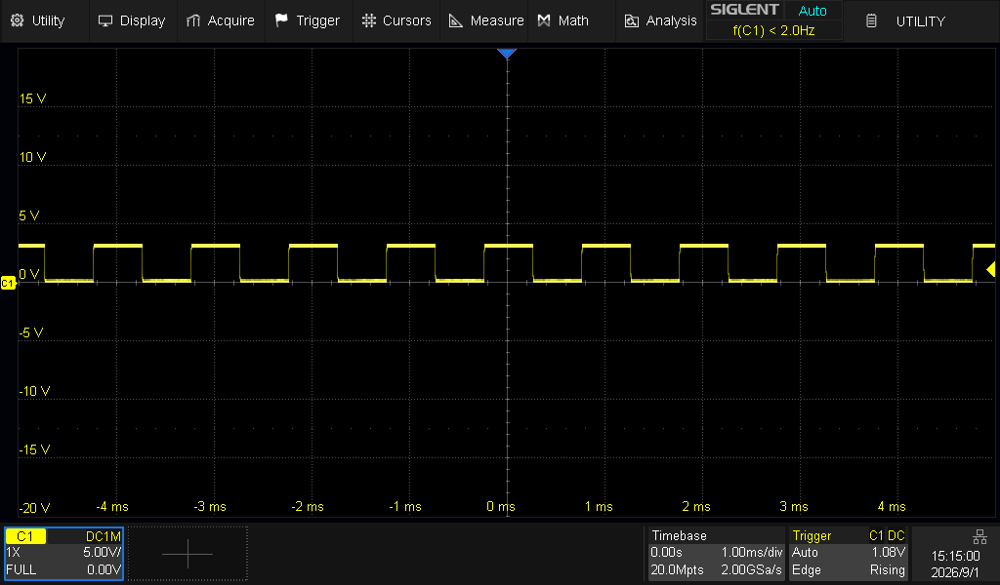

# Siglent SCPI MCP Server

`siglent-scpi-mcp` connects Siglent oscilloscopes and power supplies using SCPI over TCP to clients that support the [Model Context Protocol](https://modelcontextprotocol.io/).

The server provides typed tools for supported instruments, validates tool inputs before writing to the instrument, and reports the SCPI commands applied by each mutating call.
Structured logs and [OpenTelemetry observability](#observability) are built in.

> [!IMPORTANT]
> One bench session has run against an SDS1204X HD and an SPD3303X-E.
> It confirmed the waveform scaling chain end to end and a handful of round trips, and it found firmware behaviour the guides do not document.

> [!NOTE]
> At the risk of stating the obvious: Giving AI access to real-world machines that interact with electricity might lead to various outcomes.
> Use this tooling with appropriate caution and make sure to familiarize yourself with the [security model](#security-model) built into the MCP server.

## Supported instruments

The table describes the built-in model routing.
It does not mean that each model has been tested on hardware.

| Instrument family | Models supported by the built-in inventory | Command set |
|----|----|----|
| SDS1000X-E | `SDS1xxxX-E` | Legacy PG01-E02C |
| SDS1000X-C | `SDS1xxxX-C` | Legacy PG01-E02C using the X-E chapter as an unverified match |
| SDS1000X | `SDS1xxxX` and `SDS1xxxX+` | Legacy PG01-E02C |
| SDS2000X | `SDS2xxx` and `SDS2xxxX` | Legacy PG01-E02C |
| SDS1000 non-SPO | `SDS1xxxCFL`, `A`, `CML+`, `CNL+`, `DL+`, `E+`, and `F+` | Legacy PG01-E02C |
| SDS X HD | SDS models ending in X HD, including SDS800X HD and the SDS1000X, SDS2000X, and SDS3000X HD families | EN11F SCPI |
| SDS X Plus | SDS models ending in X Plus, including SDS2000X Plus | EN11F SCPI |
| SDS5000X, SDS6000, and SDS7000 | Model strings beginning with `SDS5xxx`, `SDS6xxx`, or `SDS7xxx` | EN11F SCPI |
| SHS800X and SHS1000X | `SHS8xxX` and `SHS1xxxX` | EN11F SCPI |
| SPD1000X | `SPD1168X` and `SPD1305X` | SPD1000X command set |
| SPD3303 | `SPD3303X`, `SPD3303X-E`, and `SPD3303C` | SPD3303 command set |

An unsupported instrument still gets the `identify` and `status` tools.
Raw SCPI tools can also be enabled, but their command support is unknown and they are not exposed by default.

You can extend model recognition with an [inventory file](#custom-model-inventory).

## Requirements

- Node.js 24 or newer
- Network access from the server to the instrument
- SCPI over TCP enabled on the instrument, normally on port `5025`
- An MCP client that supports Streamable HTTP

## Quick start

### Docker image

Run the prebuilt image published by the latest successful `main` build:

```bash
export SIGLENT_MCP_TOKEN="$(openssl rand -hex 32)"
echo "Token: $SIGLENT_MCP_TOKEN"
docker run --rm \
  -p 127.0.0.1:3000:3000 \
  -e SIGLENT_MCP_TOKEN \
  ghcr.io/mp911de/siglent-scpi-mcp:main \
  --listen 0.0.0.0 \
  192.168.1.50
```

The container requires a bearer token because it listens on a non-loopback address internally.

### npm

Install the command globally from npm:

```bash
npm install --global @mp911de/siglent-scpi-mcp
siglent-scpi-mcp 192.168.1.50
```

To install the latest GitHub revision instead, use the repository shorthand:

```bash
npm install --global mp911de/siglent-scpi-mcp
siglent-scpi-mcp 192.168.1.50
```

Replace `192.168.1.50` with the instrument host or IP address.
Add `:<port>` when the instrument does not use port `5025`.

Startup connects to the instrument and reads `*IDN?` before it opens the MCP endpoint at:

```text
http://127.0.0.1:3000/mcp
```

In another terminal, confirm that the server is running and the instrument connection is open:

```bash
curl http://127.0.0.1:3000/healthz

{"status":"ok","instrument":{"connected":true}}
```

Register the endpoint with an MCP client.
For example, register the Docker container with its bearer token in Claude Code:

```bash
claude mcp add --transport http siglent http://127.0.0.1:3000/mcp \
  --header "Authorization: Bearer $SIGLENT_MCP_TOKEN"
```

For the default npm command, which binds directly to host loopback without a token, use:

```bash
claude mcp add --transport http siglent http://127.0.0.1:3000/mcp
```

The server must remain running while the client uses the instrument.

## Configuration

### Command line

```text
Usage: siglent-scpi-mcp [options...] <host>[:port]
```

| Option | Purpose |
|----|----|
| `<host>[:port]` | Instrument address. The SCPI port defaults to 5025 |
| `-l, --listen <address>` | HTTP bind address. Defaults to `127.0.0.1` |
| `-p, --port <port>` | HTTP port. Defaults to `3000` |
| `--path <path>` | MCP endpoint path. Defaults to `/mcp`. Must be an absolute path other than `/` or `/healthz`, without a trailing slash |
| `-t, --token <token>` | Require a bearer token. Prefer the `SIGLENT_MCP_TOKEN` environment variable |
| `--inventory <file>` | Merge a JSON model inventory over the built-in table |
| `--max-response-timeout <ms>` | Longest wait for a single instrument response, 1000 to 3600000. Defaults to `180000` |
| `--enable-dangerous-commands` | Expose reboot, shutdown, calibration, LAN, and raw SCPI tools |
| `--enable-screenshots` | Expose screenshot tools |
| `--save-screenshots [format]` | Also save every capture to a session directory in the working directory, as `png` (default) or `bmp`. Requires `--enable-screenshots` |
| `--enable-lock` | Expose tools that can lock the front panel |
| `--unlock` | Clear the front-panel remote lock on connect |
| `--disable-commands <names>` | Hide comma-separated tool names |
| `--disable-setup-commands` | Hide tools annotated as setup mutations |
| `--disable-destructive-commands` | Hide tools annotated as destructive |
| `--log-level <level>` | Set `fatal`, `error`, `warn`, `info`, `debug`, or `trace`. Defaults to `info`. Passing the flag switches the console to the raw JSON log stream |
| `-v, --verbose` | Log SCPI traffic as raw JSON lines without the spinner. Same as `--log-level debug` |
| `-h, --help` | Show command help |
| `-V, --version` | Show the version |

Exit status:

- `0` after a clean shutdown
- `1` when startup cannot reach or identify the instrument
- `2` for a usage error

Terminal colors are used only when stdout and stderr are terminals and `NO_COLOR` is not set.

## Tool discovery

The selected driver determines which tools are available.
Typical oscilloscope tool groups include acquisition, channels, trigger, waveform search, serial decode, mask testing, waveform, math and FFT, measurements, cursors, saved setups and stored files, system settings, screenshots, and device-specific features.
The newer dialect also exposes waveform generator and handheld multimeter tools.
Neither is hidden per model, because nothing in the instrument identity reports the generator option.

## Security model

- The server binds to loopback by default.
- Loopback requests validate `Host` and `Origin` to reduce DNS rebinding risk.
- A non-loopback bind requires bearer authentication.
- Prefer `SIGLENT_MCP_TOKEN` to `--token`, since command lines may be visible to other users.

The health endpoint does not require authentication.
It reports only server status and whether the instrument connection is open.

## Safe tool exposure

The server hides destructive/dangerous tools by default:

- `reboot_scope`
- `shutdown_scope`
- `calibrate_scope`
- `configure_lan`
- `scpi_command`
- `scpi_query`
- `save_waveform_file`
- `clear_measurements`
- `capture_screenshot`
- `lock_front_panel`

Enable reboot, shutdown, calibration, LAN, and raw SCPI tools with:

```bash
siglent-scpi-mcp --enable-dangerous-commands 192.168.1.50
```

Enable screenshots separately:

```bash
siglent-scpi-mcp --enable-screenshots 192.168.1.50
```

Add `--save-screenshots` to also write every capture to disk in a session directory like `2026-09-01T1421_SDS1204X-HD/`.



This can be useful to prevent LLMs from taking shortcuts.

You can narrow the exposed surface further:

```bash
siglent-scpi-mcp \
  --enable-dangerous-commands \
  --disable-commands scpi_command \
  --disable-destructive-commands \
  192.168.1.50
```

`--disable-commands` takes a comma-separated list of tool names.
`--disable-setup-commands` hides setup mutations.
`--disable-destructive-commands` hides destructive tools.
Disable options always take precedence over enable options.

### Front panel lock

A remote lock makes an instrument read as stuck to a person standing at it, so locking is opt-in and unlocking is always allowed.

- `--unlock` clears the lock when the server connects.
- `--enable-lock` enables locking (disabled by default).

The SDS1204X HD engages its remote lock on its own during waveform transfers, undocumented firmware behaviour observed on the bench.

### Custom model inventory

`--inventory <file>` overlays additional model matches onto the built-in family table.
A key that names a built-in family can add models without repeating the family declaration.
A new key must define at least its device `kind`.

```json
{
  "SDS X HD": {
    "models": ["SDS1204X HD", {"pattern": "^SDS8\\d{2}X HD"}]
  },
  "Lab supply": {
    "kind": "power-supply",
    "psu": "SPD1000X",
    "models": ["SPD1168X-CUSTOM"]
  }
}
```

Exact model strings take precedence over regular expression patterns.
Inventory entries take precedence over the built-in table.

## Observability

### Traces

One tool call is one trace.
Its root span is named `tool <name>` and carries the tool name in the `mcp.tool.name` attribute.
Every SCPI exchange the call makes becomes a child span named `scpi.query`, `scpi.command`, or `scpi.binary`, carrying the line sent in the `scpi.command` attribute.
A `get_timebase` call, for instance, is one root span over four `scpi.query` children.
The connection handshake runs before any tool call, so `*IDN?` and `CHDR OFF` show up as short traces of their own at startup.

The server depends on the OpenTelemetry API alone, so every span is a no-op until a tracing SDK is registered in the process.
Nothing leaves the server until you attach one.

### Traces in Grafana

`examples/observability` holds a backend and the preload module that turns the spans on.
The backend is [grafana/otel-lgtm](https://github.com/grafana/docker-otel-lgtm), Grafana's own single-container OpenTelemetry stack for demos and development.
It publishes Grafana on port 3000, Tempo on 3200, and the OTLP HTTP endpoint on 4318.

The preload needs `@opentelemetry/sdk-node`, which is a development dependency of this project.

Start the backend:

```bash
docker compose -f examples/observability/compose.yaml up -d
```

Start the server with the preload:

```bash
OTEL_EXPORTER_OTLP_ENDPOINT=http://127.0.0.1:4318 \
  node --import ./examples/observability/otel.ts src/cli.ts --port 3001 192.168.1.50
```

## Docker

Build the image:

```bash
docker build -t siglent-scpi-mcp .
```

Run it with the HTTP port published only on host loopback:

```bash
docker run --rm \
  -p 127.0.0.1:3000:3000 \
  -e SIGLENT_MCP_TOKEN=change-me \
  siglent-scpi-mcp \
  --listen 0.0.0.0 \
  192.168.1.50
```

The process must bind to `0.0.0.0` inside the container for Docker port publishing to reach it.
A non-loopback bind requires a bearer token.
Configure the same token in the MCP client.
The container must also be able to reach the instrument on TCP port 5025.

## Documentation

- [Tool reference](docs/tools-reference.md)
- [Tool parity between the two oscilloscope dialects](docs/tool-parity.md)

## License

Siglent SCPI MCP Server is released under version 2.0 of the [Apache License](https://www.apache.org/licenses/LICENSE-2.0).
